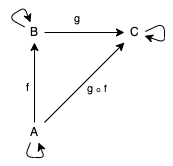

# Категория

```
Теория категорий - раздел математики, который изучает отношение математических 

объектами, не взирая на их внутреннюю структуру
```

## Что такое категории и с чем их едят

```
Катеория - набор объектов и морфизмов/стрелок/отоброжений этих объектов
```

Если убрать всякого рода 'Душнильства'
Категория - ни что иное, как ориентированный граф с некоторыми дополнительными ограничениями (рис. 1), о них мы поговорим ниже



рис. 1 - пример категории

### Как задать категорию

Что-бы наш граф, был категорией, он должен удовлетворять нескольким *законам/ограничениям*

1. У каждого объекта, должен существовать тождественный морфизм 
   `1: A -> A`

2. Для каждого морфизма категории, должна выполняться ассациативная композиция `f . (g . c) = (f . g) . c`
   Говоря проще, скобки не имеют приоретет

3. Как следует из предыдущего, для каждой стрелки 
   `f: A -> B`, `g: B -> C` есть такая композитная функция `f . g: A -> C`

#### Примеры категорий


